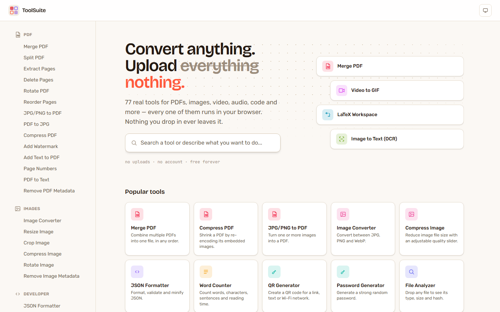
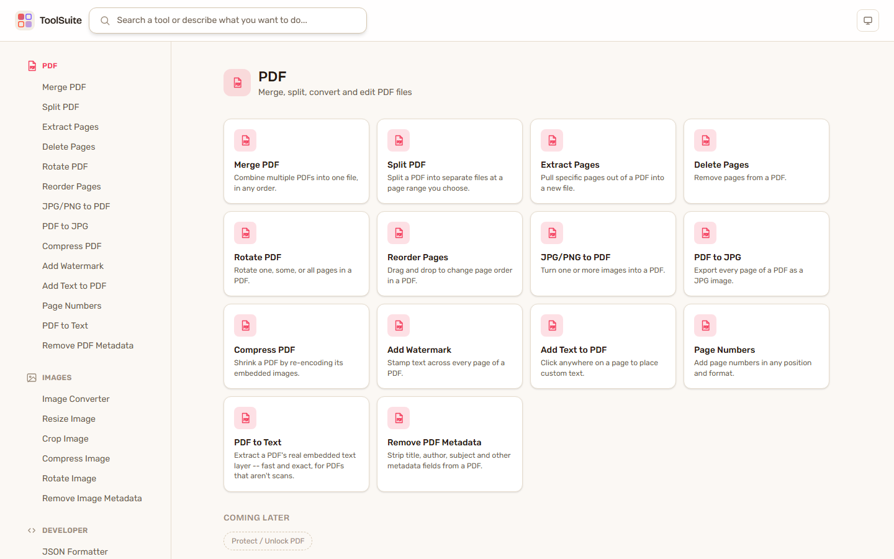
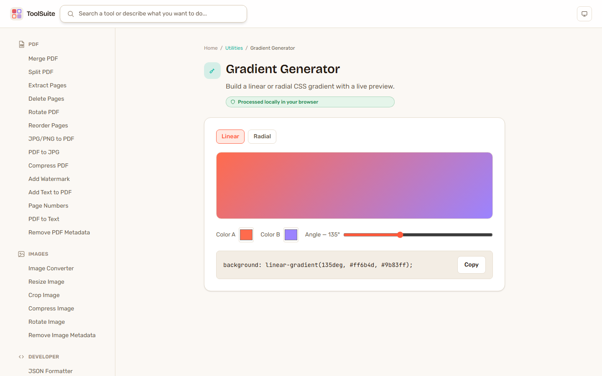
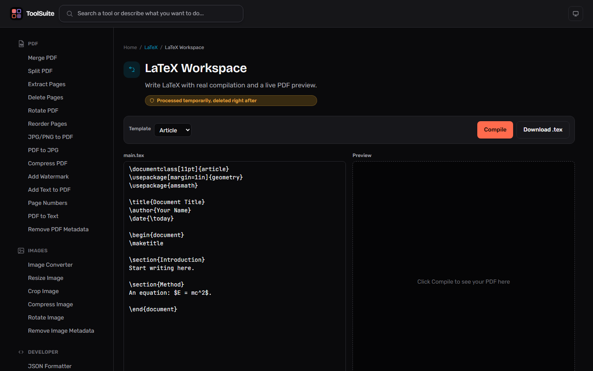
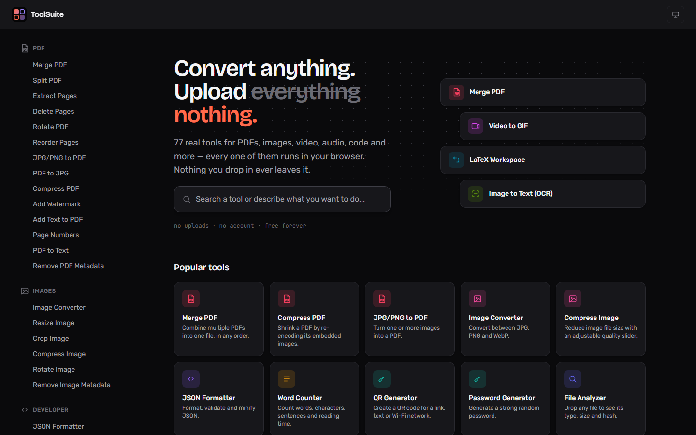

# ToolSuite

A free, privacy-first all-in-one utility site for files, media, documents, and developer tasks.

**Core principle:** nothing you upload is ever stored. Every tool below runs 100% in your
browser — no server, no database, no account. Close the tab and your file is gone, the way it
should be.



## How to use

1. **Open the site** — [multitoolsuite.vercel.app](https://multitoolsuite.vercel.app/). No sign-up, no install.
2. **Find a tool** — browse the sidebar by category, or type into the search bar on the homepage
   (it matches by name, description, and keywords — e.g. typing "shrink pdf" finds Compress PDF).
3. **Drop a file or type your input** — most tools take a file via drag-and-drop or click-to-browse;
   a few (calculators, generators, converters) just take typed input.
4. **Get your result instantly** — processing happens in your browser as you interact with the
   tool, with a live preview where it makes sense (color pickers, gradients, QR codes, LaTeX).
5. **Download** — click the download/copy button. Nothing was ever sent anywhere to get that
   result (the one exception, LaTeX compilation, is explained below).

Every tool page shows a badge — 🟢 *Processed locally in your browser* or 🟠 *Processed
temporarily, deleted right after* — so it's always clear whether a tool is client-only or the one
that briefly touches a server.

## What's built

77 fully working tools, all client-side unless noted:

- **PDF** — Merge, Split, Extract Pages, Delete Pages, Rotate, Reorder (drag-and-drop),
  JPG/PNG → PDF, PDF → JPG, Compress, Watermark, Add Text (click-to-place), Page Numbers,
  PDF to Text (real text-layer extraction), Remove PDF Metadata
- **Images** — Convert (JPG/PNG/WebP), Resize, Crop, Compress, Rotate, Remove Metadata
- **Developer** — JSON Formatter, JSON ⇄ CSV, JSON ⇄ YAML, JSON ⇄ XML, Base64, URL Encode/Decode,
  Hash Generator (MD5/SHA-1/256/512), JWT Decoder, UUID Generator, Regex Tester, SQL Formatter,
  HTML/CSS/JS Formatter
- **Text** — Word Counter, Case Converter, Text Diff, Markdown Editor, Text Cleaner (dedupe/trim),
  Lorem Ipsum Generator
- **Utilities** — QR Generator, QR Scanner, Color Converter, Color Palette Generator,
  Gradient Generator, Favicon Generator, Password Generator, Scientific Calculator,
  Unit Converter, Percentage Calculator, Number Base Converter, Date & Time Calculator,
  Random Number Generator
- **File Analyzer** — type, size, hash, and format-specific metadata for any file
- **OCR** — Image to Text, PDF to Text (real WASM OCR via Tesseract.js)
- **Archives** — Create ZIP, Extract ZIP
- **Data** — CSV Viewer, CSV Cleaner, CSV ⇄ Excel, JSON Tree Viewer
- **Web** — URL Parser, UTM Builder/Cleaner, Open Graph Generator, Robots.txt Generator,
  Sitemap Generator
- **Video** — Converter (MP4/WebM/MOV/AVI/MKV), Compressor, Trimmer, Video → GIF, Extract Audio,
  Change Resolution (real WASM FFmpeg via ffmpeg.wasm)
- **Audio** — Converter (MP3/WAV/M4A/OGG/FLAC), Trimmer, Compressor, Volume/Normalize
- **Privacy** — Sensitive Data Scanner (emails, cards, keys and more, regex-based, nothing leaves
  your browser)
- **LaTeX** — a real LaTeX editor with live compilation and PDF preview (the one tool that briefly
  uses a server — see [Backend & security](#backend--security) below)

Plus: global search, category browsing, light/dark theme, responsive layout, and a shared
component architecture so new tools are cheap to add.

<table>
<tr>
<td width="50%"></td>
<td width="50%"></td>
</tr>
<tr>
<td width="50%"></td>
<td width="50%"></td>
</tr>
</table>

## Why (almost) zero backend

Every tool above except LaTeX has a real, mature browser-side implementation:
[`pdf-lib`](https://pdf-lib.js.org/) + [`pdfjs-dist`](https://mozilla.github.io/pdf.js/) for PDFs,
the Canvas API for images, [`tesseract.js`](https://tesseract.projectnaptha.com/) (WASM) for OCR,
[`jszip`](https://stuk.github.io/jszip/) for archives, [SheetJS](https://sheetjs.com/) for Excel,
[`ffmpeg.wasm`](https://ffmpegwasm.netlify.app/) (a real WASM build of FFmpeg) for video/audio,
Web Crypto (`SubtleCrypto`) for hashing. That means the "no permanent storage" promise isn't a
policy you have to trust for those tools — there's no upload endpoint for a file to ever reach.

The one exception: OCR's language-model file (~10-15MB, English) is fetched from Tesseract's
own public CDN the first time you use an OCR tool, cached by the browser after that. It never
carries any of your file's content — it's a one-time download of Tesseract's own asset, same as
any web font. FFmpeg's engine binary (~32MB, WASM) is self-hosted from this app's own origin
instead, for the same reason pdf.js's worker is: it's a large asset, not a CDN dependency.

## Backend & security

**LaTeX compilation is the one tool that genuinely can't run in the browser** — there's no
maintained, npm-installable WASM LaTeX engine. `api/compile-latex.ts` is a Vercel serverless
function that runs [Tectonic](https://tectonic-typesetting.github.io/) (a real, self-contained
Rust TeX engine, bundled as a static binary) against only the `.tex` source text you send.
The source is written to an ephemeral `/tmp` directory, compiled, and the whole directory is
deleted immediately after — nothing is retained between requests, and nothing but the source
text itself ever leaves your browser.

Because this is the one endpoint that costs real compute (and is public/unauthenticated by
necessity — the app has no accounts), it has real defenses:

- **Size and time bounded**: 2MB max source, 55s compile timeout, capped output buffer.
- **Rate limited**: 10 compiles per 10 minutes per IP, via [Upstash](https://upstash.com/)'s free
  Redis tier (REST-based, so it works correctly from a stateless serverless function — no
  persistent connection, no in-memory counter that resets on every cold start). See
  [Rate limiting setup](#rate-limiting-setup-optional) below.
- **Least-privilege subprocess**: the compiler process gets only `PATH` and the two env vars it
  actually needs — never the function's full environment.
- **Security headers on every response** (`X-Content-Type-Options`, `X-Frame-Options`,
  `Referrer-Policy`, `Permissions-Policy`), plus `Cache-Control: no-store` on the API route so a
  compiled document is never edge-cached.

### Rate limiting setup (optional)

The app works fully without this — it just isn't rate-limited until you add it. To enable it:

1. Create a free account at [upstash.com](https://upstash.com/) and create a Redis database
   (the free tier is more than enough for this).
2. Copy the database's **REST URL** and **REST Token** from its dashboard.
3. In your Vercel project → Settings → Environment Variables, add:
   - `UPSTASH_REDIS_REST_URL`
   - `UPSTASH_REDIS_REST_TOKEN`
4. Redeploy. The LaTeX endpoint now returns `429 Too Many Requests` (with a `Retry-After` header)
   past 10 compiles/10 minutes from the same IP.

## Stack

React 19 + TypeScript + Vite 6 + Tailwind CSS v4 + React Router. No database, one small
serverless function for the reason above.

## Development

```bash
npm install
npm run dev      # http://localhost:5173
npm run build    # production build to dist/
```

The `api/` function isn't served by `vite dev` — it only runs on Vercel (or locally via
`vercel dev`). Every client-side tool works fully without it.

## Deployment

`dist/` is a static site plus one serverless function — deploy to Vercel (what this project uses)
or adapt `api/compile-latex.ts` for another provider with Node serverless functions. No env vars
are required to deploy; `UPSTASH_REDIS_REST_URL`/`UPSTASH_REDIS_REST_TOKEN` are optional (see
above). `vercel.json` also adds the rewrite a client-side router needs (every path serves
`index.html` so React Router can take over) and the security headers described above.

## Project structure

```
api/
  compile-latex.ts  # the one server-side route -- LaTeX compilation (Tectonic + rate limiting)
  bin/tectonic       # bundled compiler binary
  fonts/             # bundled free metric-compatible font substitutes
src/
  components/     # shared UI: DropZone, ToolLayout, Button, SearchBar, ...
  pages/          # HomePage, CategoryPage
  tools/          # one file per tool, grouped by category
    pdf/  images/  developer/  text/  utilities/  analyzer/
    ocr/  archives/  data/  web/  video/  audio/  latex/  privacy/
  processors/     # the actual file-processing logic (pdf.ts, image.ts, hash.ts, csv.ts,
                   # ocr.ts, archive.ts, spreadsheet.ts, pdfRender.ts, ffmpeg.ts, latex.ts)
  lib/            # registry (tool metadata), search, small utilities (color, calc, piiScan, ...)
  types/          # ToolMeta, CategoryMeta
```

Every tool is registered once in `src/lib/registry.ts` (name, description, category, path,
search keywords) and lazy-loaded in `src/App.tsx` — the homepage never downloads pdf-lib,
pdfjs-dist, tesseract.js, ffmpeg.wasm, or any other tool's dependencies until that specific tool
is opened.

`vite.config.ts` excludes `@ffmpeg/ffmpeg`/`@ffmpeg/util` from Vite's dev-mode dependency
pre-bundling — that package constructs its own Worker via a relative `import.meta.url`, which
pre-bundling breaks (the worker script silently fails to load and every ffmpeg call hangs
forever with no error). Confirmed via a real Playwright-driven browser, both in dev and against
the production build.

## Roadmap

Tools not yet built are shown in each category page as "coming later" — never as a fake button
that doesn't work. Remaining:

- **Protect/Unlock PDF** — needs real PDF encryption (pdf-lib has none); likely a qpdf-based
  serverless function, same shape as the LaTeX one but a separate build.
- **PDF → Word** — needs scoping (text-only vs. layout-preserving) before building.
- **Background Removal** — needs a real client-side segmentation model.
- **OCR → searchable PDF, BibTeX support in LaTeX** — bigger lifts, each deserving its own pass.
- **Webpage screenshot/PDF, HTTP status/header checker, real API tester** — all need a real
  backend (fetching an arbitrary third-party URL hits the browser's own CORS policy).
- **AI document tools, universal converter, workflow builder, natural-language search.**
